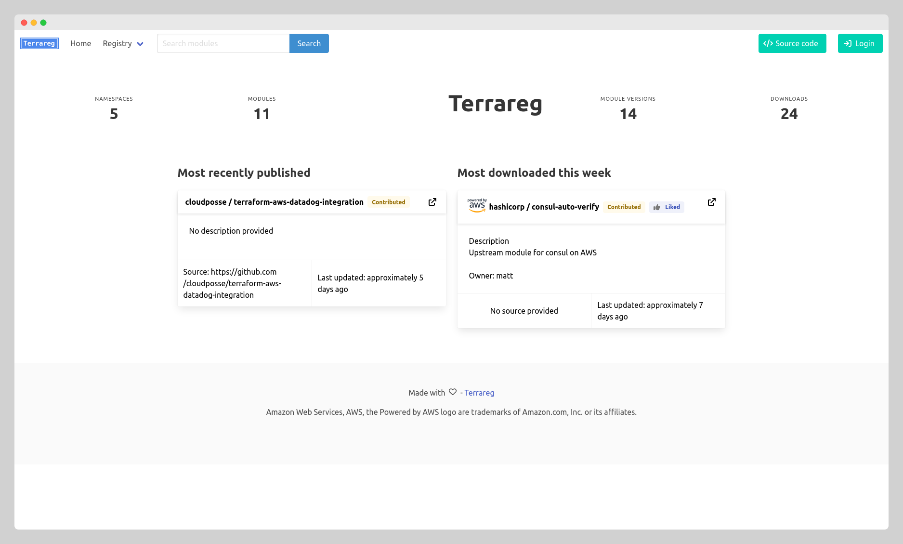
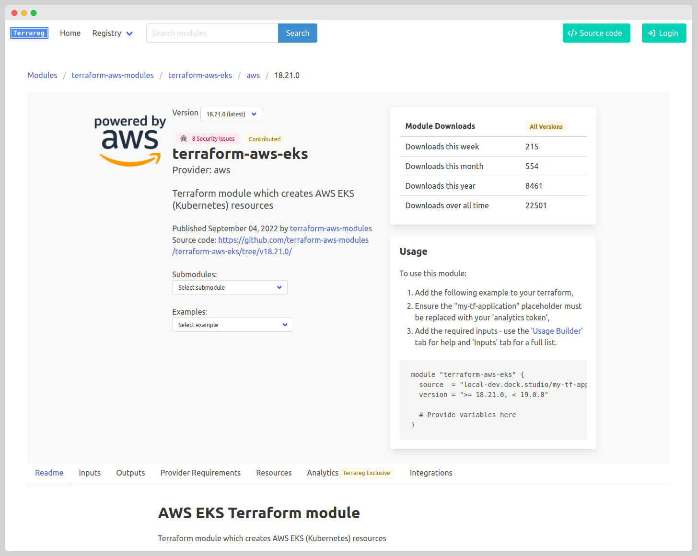
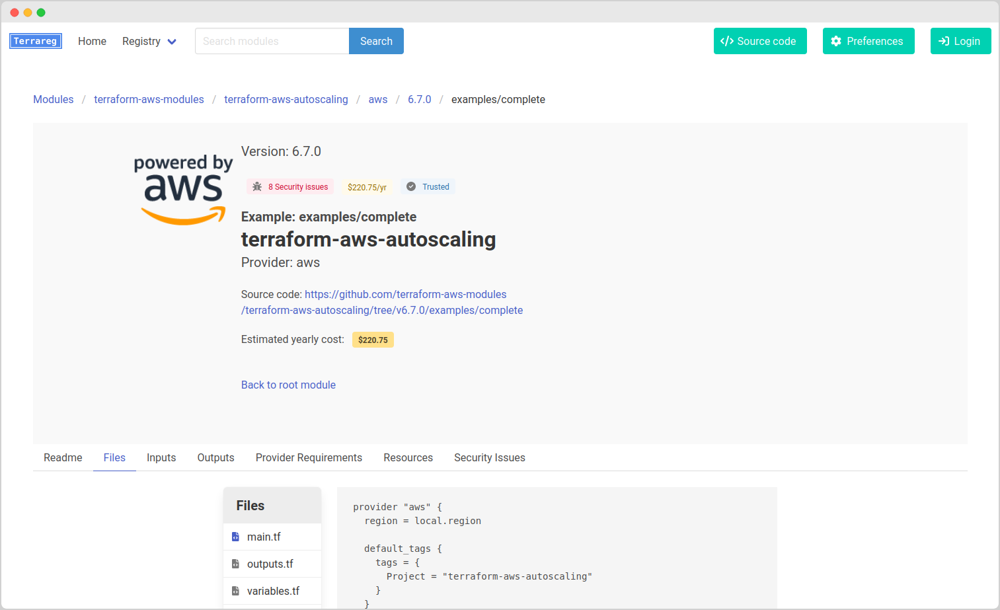

# terrareg

Open source Terraform Registry.

Provides features to aid usage and discovery of modules, providing:

 * Analytics about the usage of modules;
 * All information about a module - README, inputs, outputs, provider requirements and managed resources;
 * Security alerts for each module, submodule and examples;
 * Cost estimation for each module example;
 * Module example source code within the UI, with automatic rewriting of 'source' arguments;
 * Interactive 'Usage builder', helping users build terraform to use the terraform modules;
 * Hooks for git SCM applications to automatically index modules;

## Screenshots







## Getting started

## Running with docker

    # Clone the repository
    git clone https://github.com/matthewJohn/terrareg
    cd terrareg

    # Builder docker image
    docker build . -t terrareg:latest

    # Create secret key for session data
    export SECRET_KEY=$(python -c 'import secrets; print(secrets.token_hex())')

    # Run container, specifying secret key and admin password
    docker run -ti -p 5000:5000 -e MIGRATE_DATABASE=True -e SECRET_KEY=$SECRET_KEY -e ADMIN_AUTHENTICATION_TOKEN=MySuperSecretPassword terrareg:latest

The site can be accessed at http://localhost:5000


### Building locally and running

    # Clone the repository
    git clone https://github.com/matthewJohn/terrareg
    cd terrareg

    # Optionally create a virtualenv
    virtualenv -ppython3 venv
    . venv/bin/activate

    # Install libmagic
    ## For OS X:
    brew install libmagic

    ## For Ubuntu
    sudo apt-get install libmagic1

    # Install depdencies:
    pip install -r requirements.txt

    # Initialise database and start server:
    alembic upgrade head

    # Set a secret key and admin token
    export ADMIN_AUTHENTICATION_TOKEN=MySuperSecretPassword
    export SECRET_KEY=$(python -c 'import secrets; print(secrets.token_hex())')
    
    # Obtain terraform-docs, tfsec and infracost
    mkdir bin
    export PATH=$PATH:`pwd`/bin
    if [ "$(uname -m)" == "aarch64" ]; then arch=arm64; else arch=amd64; fi
    wget https://github.com/terraform-docs/terraform-docs/releases/download/v0.16.0/terraform-docs-v0.16.0-linux-${arch}.tar.gz && tar -zxvf terraform-docs-v0.16.0-linux-${arch}.tar.gz terraform-docs && chmod +x terraform-docs && mv terraform-docs ./bin/ && rm terraform-docs-v0.16.0-linux-${arch}.tar.gz
    wget https://github.com/aquasecurity/tfsec/releases/download/v1.26.0/tfsec-linux-${arch} -O ./bin/tfsec && chmod +x ./bin/tfsec
    wget https://github.com/infracost/infracost/releases/download/v0.10.10/infracost-linux-${arch}.tar.gz && tar -zxvf infracost-linux-${arch}.tar.gz infracost-linux-${arch} && mv infracost-linux-${arch} ./bin/infracost && chmod +x ./bin/infracost && rm infracost-linux-${arch}.tar.gz
    
    # Run the server
    python ./terrareg.py


The site can be accessed at http://localhost:5000


## Upload a terraform module:

### From a git repo


* Goto http://localhost:5000
* Login, using the button in the top-right hand corner
* Goto Modules -> Create (http://localhost:5000/create-module)
* Fill in the details for your module and 'Create'
* Use the 'Manually index version' form of your module, filling out the verison and select 'Publish' and then press 'Index Version'

### From source

    terrareg_root=$PWD
    
    cd source/of/my/module
    
    # OPTIONAL: Create an terrareg meta-data file
    echo '{ "description": "My first module", "owner": "ME!", "source": "https://github.com/me/my-tf-module" }' > ./terrareg.json
    
    # Zip up module
    zip -r ../my-tf-module.zip *
    
    # Upload to terrareg
    bash $terrareg_root/scripts/upload_module.sh http://localhost:5000 helloworld my-tf-module aws 1.0.0 ../my-tf-module.zip

  Navigate to http://localhost:5000 to get started, or http://localhost/modules/helloworld/my-tf-module to see the uploaded example!


**NOTE:** To use modules from the registry in Terraform, a valid SSL certificate must be used. Terraform will not work if you supply `http://` as a protocol for the module URL, as it will treat this as a direct HTTP download, rather than treating it as a registry.

## Docker environment variables

The following environment variables are available to configure the docker container

### MIGRATE_DATABASE

Whether to perform a database migration on container startup.

Set to `True` to enable database migration

*Note:* Be very careful when scaling the application. There should never be more than one instance of Terrareg running with `MIGRATE_DATABASE` set to `True` during an upgrade.

When upgrading, scale the application to a single instance before upgrading to a newer version.

Alternatively, set `MIGRATE_DATABASE` to `False` and run a dedicated instance for performing database upgrades.
Use `MIGRATE_DATABASE_ONLY` to run an instance that will perform the necessary database migrations and immediately exit.

Default: `False`

### MIGRATE_DATABASE_ONLY

Whether to perform database migration and exit immediately.

This is useful for scheduling migrations by starting a 'migration' instance of the application.

Set to `True` to exit after migration.

The `MIGRATE_DATABASE` environment variable must also be set to `True` to perform the migration, otherwise nothing will be performed and the container will exit.

Default: `False`

### SSH_PRIVATE_KEY

Provide the contents of the SSH key to perform git clones.

This is an alternative to mounting the '.ssh' directory of the root user.

Default: ''

## Application environment variables

The following environment variables are available to configure the application


### ADDITIONAL_MODULE_TABS


Set additional markdown files from a module to be displayed in the UI.

Value must be a JSON array of objects.
Each object of the array defines an additional tab in the module.
The object defines the name of the tab and a list of files in the repository.
e.g. `[["Tab 1 Name", ["file-to-use.md", "alternate-file-to-use.md"]], ["tab 2", ["tab_2_file.md"]]]`

The tabs will be displayed in order of their placement in the outer list.
If multiple files are provided, the first file found in the repository will be used for the tab content.

Filenames with an extension `.md` will be treated as markdown. All other files will be treated as plain-text.

E.g.
```
[["Release Notes": ["RELEASE_NOTES.md", "CHANGELOG.md"]], ["Development Guidelines", ["CONTRIBUTING.md"]], ["License", ["LICENSE"]]]
```


Default: `[["Release Notes", ["RELEASE_NOTES.md", "CHANGELOG.md"]], ["License", ["LICENSE"]]]`


### ADMIN_AUTHENTICATION_TOKEN


Token to use for authorisation to be able to modify modules in the user interface.


Default: ``


### ADMIN_SESSION_EXPIRY_MINS


Session timeout for admin cookie sessions


Default: `60`


### ALLOWED_PROVIDERS


Comma-seperated list of allowed providers.

Leave empty to disable allow-list and allow all providers.


Default: ``


### ALLOW_CUSTOM_GIT_URL_MODULE_PROVIDER


Whether module providers can specify their own git repository source.


Default: `True`


### ALLOW_CUSTOM_GIT_URL_MODULE_VERSION


Whether module versions can specify git repository in terrareg config.


Default: `True`


### ALLOW_MODULE_HOSTING


Whether uploaded modules can be downloaded directly.
If disabled, all modules must be configured with a git URL.


Default: `True`


### ALLOW_UNIDENTIFIED_DOWNLOADS


Whether modules can be downloaded with terraform
without specifying an identification string in
the namespace


Default: `False`


### ANALYTICS_AUTH_KEYS


List of comma-separated values for terraform auth tokens for deployment environments.

E.g. `xxxxxx.deploy1.xxxxxxxxxxxxx:dev,zzzzzz.deploy1.zzzzzzzzzzzzz:prod`
In this example, in the 'dev' environment, the auth token for terraform would be: `xxxxxx.deploy1.xxxxxxxxxxxxx`
and the auth token for terraform for prod would be: `zzzzzz.deploy1.zzzzzzzzzzzzz`.

To disable auth tokens and to report all downloads, leave empty.

To only record downloads in a single environment, specify a single auth token. E.g. `zzzzzz.deploy1.zzzzzzzzzzzzz`

For information on using these API keys, please see Terraform: https://docs.w3cub.com/terraform/commands/cli-config.html#credentials


Default: ``


### ANALYTICS_TOKEN_DESCRIPTION

Describe to be provided to user about analytics token (e.g. `The name of your application`)

Default: ``


### ANALYTICS_TOKEN_PHRASE

Name of analytics token to provide in responses (e.g. `application name`, `team name` etc.)

Default: `analytics token`


### APPLICATION_NAME

Name of application to be displayed in web interface.

Default: `Terrareg`


### AUTOGENERATE_MODULE_PROVIDER_DESCRIPTION


Whether to automatically generate module provider descriptions, if they are not provided in terrareg metadata file of the module.


Default: `True`


### AUTOGENERATE_USAGE_BUILDER_VARIABLES


Whether to automatically generate usage builder variables from the required variables and their descriptions.
When disabled, the usage builder will only be displayed on a module when the "variable_template" section
of the terrareg.json metadata file is populated.


Default: `True`


### AUTO_CREATE_MODULE_PROVIDER


Whether to automatically create module providers when
uploading module versions, either from create endpoint or hooks.

If disabled, modules must be created using the module provider create endpoint (or via the web interface).


Default: `True`


### AUTO_PUBLISH_MODULE_VERSIONS


Whether new module versions (either via upload, import or hook) are automatically
published and available.

If this is disabled, the publish endpoint must be called before the module version
is displayed in the list of module versions.

NOTE: Even whilst in an unpublished state, the module version can still be accessed directly, but not used within terraform.


Default: `True`


### CONTRIBUTED_NAMESPACE_LABEL

Custom name for 'contributed namespace' in UI.

Default: `Contributed`


### DATABASE_URL


URL for database.
Defaults to local sqlite database.

To setup SQLite datbase, use `sqlite:///<path to sqlite DB>`

To setup MySQL, use `mysql+mysqlconnector://<user>:<password>@<host>[:<port>]/<database>`


Default: `sqlite:///modules.db`


### DATA_DIRECTORY


Default: `./data`


### DEBUG

Whether flask and sqlalchemy is setup in debug mode.

Default: `False`


### DELETE_EXTERNALLY_HOSTED_ARTIFACTS


Whether uploaded modules, that provide an external URL for the artifact,
should be removed after analysis.
If enabled, module versions with externally hosted artifacts cannot be re-analysed after upload.


Default: `False`


### DISABLE_TERRAREG_EXCLUSIVE_LABELS


Whether to disable 'terrareg exclusive' labels from feature tabs in UI.

Set to 'True' to disable the labels.


Default: `False`


### DOMAIN_NAME


Domain name that the system is hosted on.

This should be setup for all installations, but is required for infracost and OpenID authentication.


Default: ``


### ENABLE_SECURITY_SCANNING


Whether to perform security scans of uploaded modules and display them against the module, submodules and examples.


Default: `True`


### EXAMPLES_DIRECTORY


Directory with a module's source that contains examples.

Examples are expected to be within sub-directories of the examples directory.

E.g. If EXAMPLES_DIRECTORY is set to `examples`, with the root module, the following would be expected for an example: `examples/myexample/main.tf`.


Default: `examples`


### EXAMPLE_ANALYTICS_TOKEN


Example analytics token to provide in responses (e.g. my-tf-application, my-slack-channel etc.).

Note that, if this token is used in a module call, it will be ignored and treated as if
an analytics token has not been provided.
If analytics tokens are required, this stops users from accidently using the example placeholder in
terraform projects.


Default: `my-tf-application`


### GIT_PROVIDER_CONFIG


Git provider config.
JSON list of known git providers.
Each item in the list should contain the following attributes:
- name - Name of the git provider (e.g. 'Corporate Gitlab')

- base_url - Formatted base URL for project's repo.
(e.g. 'https://github.com/{namespace}/{module}'
or 'https://gitlab.corporate.com/{namespace}/{module}')
- clone_url - Formatted clone URL for modules.
(e.g. 'ssh://gitlab.corporate.com/scm/{namespace}/{module}.git'
or 'https://github.com/{namespace}/{module}-{provider}.git')
Note: Do not include '{version}' placeholder in the URL -
the git tag will be automatically provided.

- browse_url - Formatted URL for user-viewable source code
(e.g. 'https://github.com/{namespace}/{module}-{provider}/tree/{tag}/{path}'
or 'https://bitbucket.org/{namespace}/{module}/src/{version}?at=refs%2Ftags%2F{tag_uri_encoded}').
Must include placeholdes:
- {path} (for source file/folder path)
- {tag} or {tag_uri_encoded} for the git tag

An example for public repositories might be:
```
[{"name": "Github", "base_url": "https://github.com/{namespace}/{module}", "clone_url": "ssh://git@github.com:{namespace}/{module}.git", "browse_url": "https://github.com/{namespace}/{module}/tree/{tag}/{path}"},
{"name": "Bitbucket", "base_url": "https://bitbucket.org/{namespace}/{module}", "clone_url": "ssh://git@bitbucket.org:{namespace}/{module}-{provider}.git", "browse_url": "https://bitbucket.org/{namespace}/{module}-{provider}/src/{tag}/{path}"},
{"name": "Gitlab", "base_url": "https://gitlab.com/{namespace}/{module}", "clone_url": "ssh://git@gitlab.com:{namespace}/{module}-{provider}.git", "browse_url": "https://gitlab.com/{namespace}/{module}-{provider}/-/tree/{tag}/{path}"}]
```


Default: `[]`


### INFRACOST_API_KEY


API key for Infracost.

Set this to enable cost-analysis of module examples.

To generate an API key:
Log in at https://dashboard.infracost.io > select your organization > Settings

For cost analysis to be performed on modules which utilise other modules from this registry, ensure `DOMAIN_NAME` is set.


Default: ``


### INFRACOST_PRICING_API_ENDPOINT


Self-hosted infracost pricing API endpoint.

For information on self-hosting the infracost pricing API, see https://www.infracost.io/docs/cloud_pricing_api/self_hosted/


Default: ``


### INFRACOST_TLS_INSECURE_SKIP_VERIFY


Whether to skip TLS verification for self-hosted pricing endpoints


Default: `False`


### LISTEN_PORT


Port for server to listen on.


Default: `5000`


### LOGO_URL

URL of logo to be used in web interface.

Default: `/static/images/logo.png`


### MODULES_DIRECTORY


Directory with a module's source that contains sub-modules.

submodules are expected to be within sub-directories of the submodule directory.

E.g. If MODULES_DIRECTORY is set to `modules`, with the root module, the following would be expected for a submodule: `modules/submodulename/main.tf`.

This can be set to an empty string, to expected submodules to be in the root directory of the parent module.


Default: `modules`


### OPENID_CONNECT_CLIENT_ID


Client ID for OpenID conect authentication


Default: ``


### OPENID_CONNECT_CLIENT_SECRET


Client secret for OpenID conect authentication


Default: ``


### OPENID_CONNECT_ISSUER


Base Issuer URL for OpenID conect authentication


Default: ``


### PUBLISH_API_KEYS


List of comma-separated list of API keys to publish module versions.

To disable authentication for publish endpoint, leave empty.


Default: ``


### REQUIRED_MODULE_METADATA_ATTRIBUTES


Comma-seperated list of metadata attributes that each uploaded module _must_ contain, otherwise the upload is aborted.


Default: ``


### SECRET_KEY


Flask secret key used for encrypting sessions.

Can be generated using: `python -c 'import secrets; print(secrets.token_hex())'`


Default: ``


### SSL_CERT_PRIVATE_KEY


Path to SSL private certificate key.

If running in a container, the key must be mounted inside the container.
This value must be set to the path of the key within the container.

This must be set in accordance with SSL_CERT_PUBLIC_KEY - both must either be
set or left empty.


Default: ``


### SSL_CERT_PUBLIC_KEY


Path to SSL public key.

If running in a container, the key must be mounted inside the container.
This value must be set to the path of the key within the container.

This must be set in accordance with SSL_CERT_PRIVATE_KEY - both must either be
set or left empty.


Default: ``


### TERRAFORM_EXAMPLE_VERSION_TEMPLATE


Template of version number string to be used in terraform examples in the UI.
This is used by the snippet example of a terraform module and the 'resource builder' example.

The template can contain the following placeholders:
* `{major}`, `{minor}`, `{patch}`
* `{major_minus_one}`, `{minor_minus_one}`, `{patch_minus_one}`
* `{major_plus_one}`, `{minor_plus_one}`, `{patch_plus_one}`

Some examples:
* `>= {major}.{minor}.{patch}, < {major_plus_one}.0.0`
* `~> {major}.{minor}.{patch}`

For more information, see terraform documentation: https://www.terraform.io/language/expressions/version-constraints


Default: `{major}.{minor}.{patch}`


### THREADED

Whether flask is configured to enable threading

Default: `True`


### TRUSTED_NAMESPACES

Comma-separated list of trusted namespaces.

Default: ``


### TRUSTED_NAMESPACE_LABEL

Custom name for 'trusted namespace' in UI.

Default: `Trusted`


### UPLOAD_API_KEYS


List of comma-separated list of API keys to upload/import new module versions.

For bitbucket hooks, one of these keys must be provided as the 'secret' to the webhook.

To disable authentication for upload endpoint, leave empty.


Default: ``


### VERIFIED_MODULE_LABEL

Custom name for 'verified module' in UI.

Default: `Verified`


### VERIFIED_MODULE_NAMESPACES


List of namespaces, who's modules will be automatically set to verified.


Default: ``


## Terrareg module metadata

A metadata file can be provided each an uploaded module's archive to provide additional metadata to terrareg.

For an example, please see: [docs/example-terrareg-module-metadata.json](./docs/example-terrareg-module-metadata.json)

The following attributes are available at the root of the JSON object:

|Key |Description|
--- | --- |
|owner|Name of the owner of the module|
|description|Description of the module|
|variable_template|Structure holding required input variables for module, used for 'Usage Builder'. See table below|
|repo_clone_url|Url to clone the repository. Optional placeholders `{namespace}`, `{module}` and `{provider}` can be used. E.g. `ssh://gitlab.corporate.com/scm/{namespace}/{module}.git`|
|repo_base_url|Formatted base URL for project's repo. E.g. `https://gitlab.corporate.com/{namespace}/{module}`|
|repo_browse_url|Formatted URL for user-viewable source code. Must contain `{tag}` and `{path}` placeholders. E.g. `https://github.com/{namespace}/{module}-{provider}/blob/{tag}/{path}`|

### Usage builder configuration

The usage builder requires an array of objects, which define the name, type and description of the variable.

In the following the 'config input' refers to the HTML inputs that provide the user with the ability to select/enter values. The 'terraform input' refers to the value used for the variable in the outputted terraform example.

There are common attributes that can be added to each of variable objects, which include:

|Attribute |Description |Default|
--- | --- | ---|
|name|The name of the 'config input'. This is also used as the module variable in the 'terraform input'.|Required|
|type|The type of the input variable, see table below.|Required|
|quote_value|Boolean flag to determine whether the value generated is quoted for the 'terraform input'.|false|
|additional_help|A description that is provided, along with the terraform variable description in the usage builder|Empty|


|Variable type|Description|Type specific attributes|
--- | --- | ---|
|text|A plain input text box for users to provide a value that it directly used as the 'terraform input'||
|boolean|Provides a checkbox that results in a true/false value as the 'terraform input'||
|static|This does not appear in the 'Usage Builder' 'config input' table, but provides a static value in the 'terraform input'||
|select|Provides a dropdown for the user to select from a list of choices|"choices" must be added to the object, which may either be a list of strings, or a list of objects. If using a list of objects, a "name" and "value" must be provided. Optionally an "additional_content" attribute can be added to the choice, which provides additional terraform to be added to the top of the terraform example. The main variable object may also contain a "allow_custom" boolean attribute, which allows the user to enter a custom text input.|

## Changelog

See [CHANGELOG.md](CHANGELOG.md)


## Local development

Since terraform requires HTTPS with a valid SSL cert, this must be provided in local development

On linux, by default, non-privileged users cannot listen on privileged ports, so the following can be used to route requests locally to port 5000:

```
sudo iptables -t nat -I OUTPUT -p tcp -d 127.0.0.1 --dport 443 -j REDIRECT --to-ports 5000
```

Example to run in local development environment:
```
virtualenv -ppython3.8 venv
. venv/bin/activate
pip install -r requirements.txt
pip install -r requirements-dev.txt

# Without SSL cert
ALLOW_CUSTOM_GIT_URL_MODULE_PROVIDER=False ALLOW_CUSTOM_GIT_URL_MODULE_VERSION=False GIT_PROVIDER_CONFIG='[{"name": "Github", "base_url": "https://github.com/{namespace}/{module}", "clone_url": "ssh://git@github.com:{namespace}/{module}.git", "browse_url": "https://github.com/{namespace}/{module}/tree/{tag}/{path}"}, {"name": "Bitbucket", "base_url": "https://bitbucket.org/{namespace}/{module}", "clone_url": "ssh://git@bitbucket.org:{namespace}/{module}-{provider}.git", "browse_url": "https://bitbucket.org/{namespace}/{module}-{provider}/src/{tag}/{path}"}, {"name": "Gitlab", "base_url": "https://gitlab.com/{namespace}/{module}", "clone_url": "ssh://git@gitlab.com:{namespace}/{module}-{provider}.git", "browse_url": "https://gitlab.com/{namespace}/{module}-{provider}/-/tree/{tag}/{path}"}]' SECRET_KEY=ec9b8cc5ed0404acb3983b7836844d828728c22c28ecbed9095edef9b7489e85 ADMIN_AUTHENTICATION_TOKEN=password ANALYTICS_AUTH_KEYS=xxxxxx.atlasv1.zzzzzzzzzzzzz:dev,xxxxxx.atlasv1.xxxxxxxxxx:prod VERIFIED_MODULE_NAMESPACES=hashicorp TRUSTED_NAMESPACES=test DEBUG=True AUTO_PUBLISH_MODULE_VERSIONS=False LISTEN_PORT=5001 python ./terrareg.py

# With SSL Cert
# Add the following argument
#  --ssl-cert-private-key ./example/ssl-certs/private.pem --ssl-cert-public-key ./example/ssl-certs/public.pem

```

## Generating DB changes

```
alembic revision --autogenerate
```

## Applying DB changes

```
alembic upgrade head
```

# License

This project and all associated code is covered by GNU General Public License v3.0.

For full license, see [LICENSE](LICENSE)

# Contributors

 * Matt Comben <matthew@dockstudios.co.uk>

## Special thanks

 *  David Soff <david@soff.nl> for implementing Github hook support
